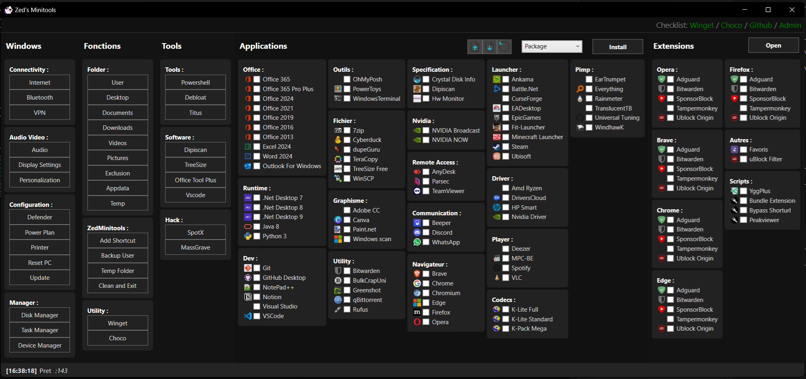

# ZMT

Open source setup tool

Here is my take on a setup tool CTT Style



#### Running it

```
irm https://raw.githubusercontent.com/MonsieurZed/ZMT/refs/heads/main/zed.ps1 | iex
```

Shorten url will come soon

## What is it ?

Zed's Toolkit aim to make a fresh install of windows easier by providing one for all installer tools. This will be achieve by creating an GUI that allow the user :

- Bulk install package from Winget, chocolatey, any executable Path, archive Path or Iso Path.
- Per browers extensions shortcut
- Access user folders
- Access to most windows interface
- Access to most useful irm|iex tools

## What next ?

- Better UI/UX
- Rredegit tweaks
- Package search
- Multi Language support

## Licence

- This project is under the licence GNU3

## Author

- [MonsieurZed](https://github.com/MonsieurZed)


